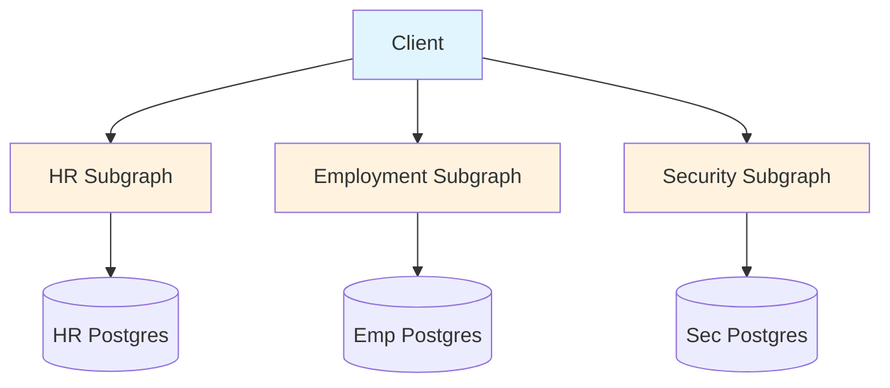
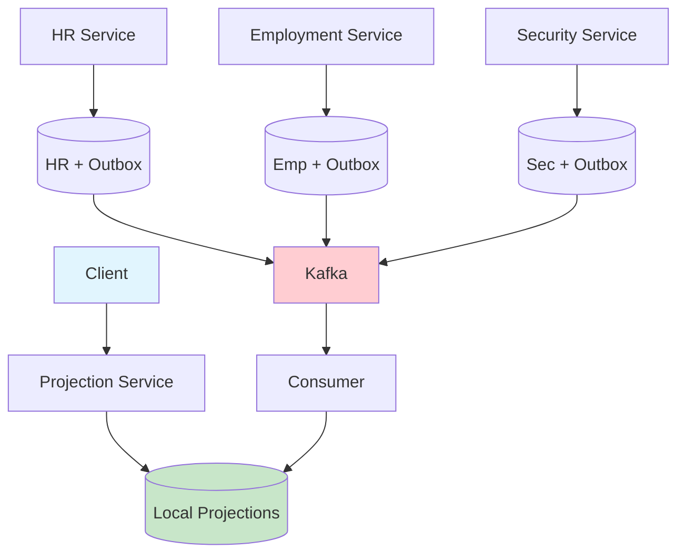
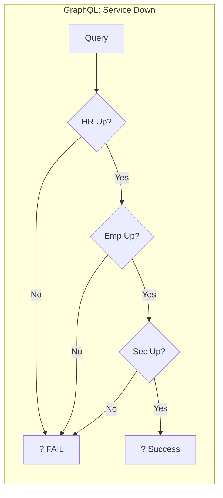
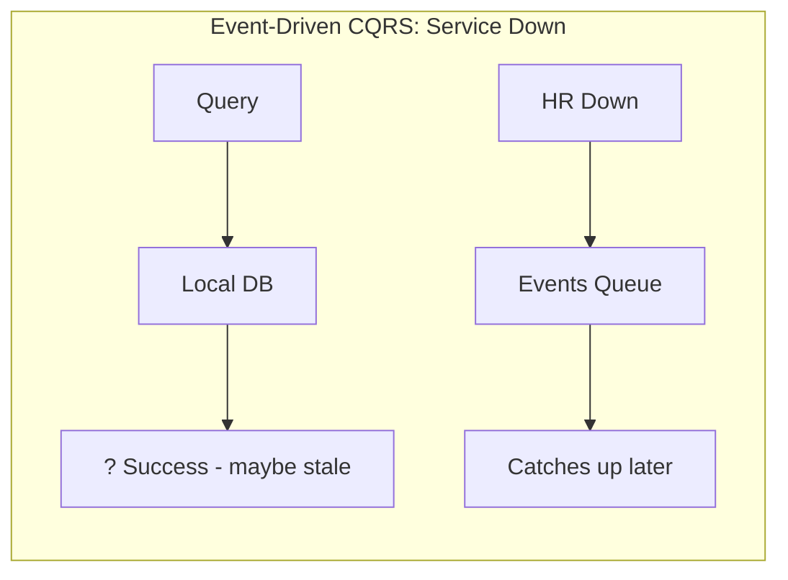

# Project: Federation vs Event-Driven CQRS Architecture Comparison Demo

## Overview

Build a side-by-side demonstration of two architectures running in local Kubernetes (kind, k3d, or minikube):

1. **GraphQL Federation** - Separate subgraphs, client-side composition, sync queries
2. **Event-Driven CQRS** - Kafka, local projections, async propagation

Both architectures model the same domain: **Person/Employee/Badge** across HR, Employment, and Security bounded contexts.

The goal is to demonstrate the tradeoffs discussed in distributed systems design � NOT to prove one is "better."

---

## Domain Model

Three bounded contexts, each with their own meaning of related data:

### HR Context
- Owns: `Person`
- Fields: `id`, `name`, `email`, `hireDate`
- Events published: `PersonCreated`, `PersonUpdated`, `PersonTerminated`

### Employment Context  
- Owns: `Employee`
- Correlates to Person via `personId`
- Fields: `id`, `personId`, `title`, `department`, `salary`
- Events published: `EmployeeAssigned`, `EmployeePromoted`, `EmployeeTransferred`

### Security Context
- Owns: `BadgeHolder`
- Correlates to Person via `personId`
- Fields: `id`, `personId`, `badgeNumber`, `accessLevel`, `clearance`
- Events published: `BadgeProvisioned`, `AccessLevelChanged`, `BadgeRevoked`

---

## Architecture 1: GraphQL Federation
```
+-----------------------------------------------------------------+
�                          Client                                  �
�                  (queries each subgraph)                         �
+-----------------------------------------------------------------+
                              �
          +-------------------+-------------------+
          ?                   ?                   ?
    +----------+        +----------+        +----------+
    �    HR    �        �Employment�        � Security �
    � Subgraph �        � Subgraph �        � Subgraph �
    � (Person) �        �(Employee)�        �(BadgeHldr)�
    +----------+        +----------+        +----------+
         �                   �                   �
         ?                   ?                   ?
    +----------+        +----------+        +----------+
    � Postgres �        � Postgres �        � Postgres �
    �    HR    �        �   Emp    �        �   Sec    �
    +----------+        +----------+        +----------+
```

**Key characteristics:**
- NO gateway (client composes)
- NO type extension (separate types, correlated by personId)
- Each subgraph is independent
- Client queries what it needs from each

**Tech stack:**
- Quarkus with SmallRye GraphQL (or Spring Boot with DGS if preferred)
- Each subgraph has its own PostgreSQL
- Native compilation for fast startup, low memory

---

## Architecture 2: Event-Driven CQRS
```
+-----------------------------------------------------------------+
│                          Client                                  │
│                   (queries local service)                        │
+-----------------------------------------------------------------+
                              │
                              ▼
                    +------------------+
                    │ Projection Svc   │
                    │  (local copies)  │
                    +------------------+
                             �
                             ?
                    +------------------+
                    �    Local DB      �
                    � (projections of  �
                    �  Person+Emp+Badge)�
                    +------------------+
                             ?
                             � consumes
                             �
+-----------------------------------------------------------------+
�                          Kafka                                   �
�  Topics: hr.person, employment.employee, security.badge         �
+-----------------------------------------------------------------+
                             ?
         +-------------------+-------------------+
         �                   �                   �
    +----------+        +----------+        +----------+
    �    HR    �        �Employment�        � Security �
    � Service  �        � Service  �        � Service  �
    �(producer)�        �(producer)�        �(producer)�
    +----------+        +----------+        +----------+
         �                   �                   �
         ?                   ?                   ?
    +----------+        +----------+        +----------+
    � Postgres �        � Postgres �        � Postgres �
    � + Outbox �        � + Outbox �        � + Outbox �
    +----------+        +----------+        +----------+
```

**Key characteristics:**
- Outbox pattern for reliable event publishing
- Debezium CDC (or simple polling) to get events to Kafka
- Consumer service maintains local projections
- Query service reads from local DB only

**Tech stack:**
- Quarkus or Spring Boot services
- Kafka (KRaft mode, no Zookeeper)
- Schema Registry (Apicurio or Confluent)
- Debezium for CDC (or simple outbox polling)
- Each source service has PostgreSQL with outbox table

---

## Dashboard/Demo UI Requirements

Build a single-page dashboard that shows both architectures side by side:

### Layout
```
+-----------------------------------------------------------------------------+
�                    ARCHITECTURE COMPARISON DASHBOARD                         �
+-----------------------------------------------------------------------------�
│         GRAPHQL FEDERATION         │         EVENT-DRIVEN CQRS              │
+------------------------------------+----------------------------------------�
�                                    �                                        �
�  [Architecture Diagram - Mermaid]  �  [Architecture Diagram - Mermaid]      �
�                                    �                                        �
+------------------------------------+----------------------------------------�
�                                    �                                        �
�  [Service Status Indicators]       �  [Service Status Indicators]           �
�  HR: ? UP    Emp: ? UP   Sec: ? UP �  HR: ? UP   Kafka: ? UP  Consumer: ? UP�
�                                    �                                        �
+------------------------------------+----------------------------------------�
�                                    �                                        �
�  [Create Person Button]            �  [Create Person Button]                �
�                                    �                                        �
�  [Query Composed View Button]      �  [Query Local Projection Button]       �
�                                    �                                        �
+------------------------------------+----------------------------------------�
�                                    �                                        �
�  Query Latency: 45ms               �  Query Latency: 3ms                    �
�  Services Called: 3                �  Services Called: 1                    �
�  Data Freshness: REAL-TIME         �  Data Freshness: 2.3s lag              �
�                                    �                                        �
+------------------------------------+----------------------------------------�
�                                    �                                        �
�  [Request/Response Log]            �  [Event Log / Consumer Lag]            �
�                                    �                                        �
+-----------------------------------------------------------------------------+
```

### Mermaid Diagrams to Embed

**GraphQL Side:**


**Event-Driven CQRS Side:**


**Failure Comparison:**



### Demo Scenarios

The UI should have buttons/controls to demonstrate:

1. **Happy Path**
   - Create a person in HR
   - Assign as employee
   - Provision badge
   - Query composed view from both sides
   - Show latency difference

2. **Service Failure**
   - Button to kill Security service
   - Show GraphQL queries that touch Security fail
   - Show Event-Driven queries still work (stale data indicator)
   - Bring service back, show recovery

3. **Latency Comparison**
   - Query that touches all 3 contexts
   - GraphQL: show additive latency (HR + Emp + Sec)
   - Event-Driven CQRS: show local query latency

4. **Consumer Lag Demo**
   - Pause the Event-Driven consumer
   - Create several entities
   - Show lag building up
   - Resume consumer
   - Show catch-up

5. **Scale Simulation**
   - Generate N queries/sec to both sides
   - Show request count to each service (GraphQL: N×3, Event-Driven: N×1)

---

## Observability Requirements

### GraphQL Side
- Request count per subgraph
- Latency per subgraph
- Error rate per subgraph
- Composed query latency (sum)

### Event-Driven CQRS Side
- Kafka consumer lag (per topic, per partition)
- Event throughput
- Projection freshness (time since last update per entity type)
- Consumer processing rate
- DLQ size

### Both
- Service health indicators
- Database connection status
- Memory/CPU (if possible)

---

## Kubernetes Setup

Use Helm charts or Kustomize. Structure:
```
k8s/
+-- base/
�   +-- namespace.yaml
�   +-- common-config.yaml
+-- federation/
�   +-- hr-subgraph/
�   �   +-- deployment.yaml
�   �   +-- service.yaml
�   �   +-- postgres.yaml
�   +-- employment-subgraph/
�   �   +-- ...
�   +-- security-subgraph/
�   �   +-- ...
�   +-- kustomization.yaml
+-- event-driven/
│   +-- kafka/
│   │   +-- kafka.yaml (KRaft mode)
│   │   +-- schema-registry.yaml
│   +-- hr-service/
│   │   +-- deployment.yaml
│   │   +-- service.yaml
│   │   +-- postgres-with-outbox.yaml
│   +-- employment-service/
│   │   +-- ...
│   +-- security-service/
│   │   +-- ...
│   +-- consumer-service/
│   │   +-- deployment.yaml
│   +-- projection-service/
│   │   +-- deployment.yaml
│   +-- kustomization.yaml
+-- dashboard/
�   +-- deployment.yaml
�   +-- service.yaml
+-- kustomization.yaml
```

### Local Development

Provide:
- `skaffold.yaml` for hot-reload development
- `tilt` file as alternative
- Simple `make` commands:
  - `make up` - start everything
  - `make down` - tear down
  - `make federation-only` - just the GraphQL side
  - `make cdc-only` - just the Event-Driven CQRS side
  - `make kill-security` - simulate failure
  - `make restore-security` - bring it back
  - `make logs-kafka` - tail Kafka logs
  - `make lag` - show consumer lag

---

## Service Implementation Details

### GraphQL Subgraph (Example: HR)
```java
// HRResource.java (Quarkus)
@GraphQLApi
public class HRResource {
    
    @Inject
    PersonRepository personRepository;
    
    @Query
    public List persons() {
        return personRepository.listAll();
    }
    
    @Query  
    public Person person(@Name("id") String id) {
        return personRepository.findById(id);
    }
    
    @Mutation
    public Person createPerson(@Name("input") PersonInput input) {
        Person person = new Person(input);
        personRepository.persist(person);
        return person;
    }
}
```

### Event-Driven Producer (Example: HR with Outbox)
```java
// HRService.java
@ApplicationScoped
public class HRService {
    
    @Inject
    PersonRepository personRepository;
    
    @Inject
    OutboxRepository outboxRepository;
    
    @Transactional
    public Person createPerson(PersonInput input) {
        Person person = new Person(input);
        personRepository.persist(person);
        
        // Same transaction - atomic
        OutboxEvent event = new OutboxEvent(
            "hr.person",
            person.getId(),
            "PersonCreated",
            toJson(person)
        );
        outboxRepository.persist(event);
        
        return person;
    }
}

// OutboxRelay.java (polls and publishes)
@ApplicationScoped
public class OutboxRelay {
    
    @Inject
    OutboxRepository outboxRepository;
    
    @Inject
    @Channel("outbox-out")
    Emitter emitter;
    
    @Scheduled(every = "1s")
    @Transactional
    public void pollAndPublish() {
        List events = outboxRepository.findUnpublished();
        for (OutboxEvent event : events) {
            emitter.send(event);
            event.markPublished();
        }
    }
}
```

### Event-Driven Consumer (Projection Builder)
```java
// ProjectionConsumer.java
@ApplicationScoped
public class ProjectionConsumer {
    
    @Inject
    LocalProjectionRepository projectionRepository;
    
    @Incoming("hr-person")
    @Transactional
    public void onPersonEvent(PersonEvent event) {
        // Idempotency check
        if (projectionRepository.hasProcessed(event.getId())) {
            return;
        }
        
        switch (event.getType()) {
            case "PersonCreated":
                projectionRepository.upsertPerson(event.getData());
                break;
            case "PersonUpdated":
                projectionRepository.upsertPerson(event.getData());
                break;
            case "PersonTerminated":
                projectionRepository.markTerminated(event.getData().getId());
                break;
        }
        
        projectionRepository.markProcessed(event.getId());
    }
    
    // Similar for Employee and Badge events...
}
```

### Projection Service (Local Projections)
```java
// QueryResource.java
@Path("/api")
public class QueryResource {
    
    @Inject
    LocalProjectionRepository projectionRepository;
    
    @GET
    @Path("/composed/{personId}")
    public ComposedView getComposedView(@PathParam("personId") String personId) {
        // Single local query - no network calls
        return projectionRepository.getComposedView(personId);
    }
    
    @GET
    @Path("/freshness")
    public FreshnessInfo getFreshness() {
        return new FreshnessInfo(
            projectionRepository.getLastPersonUpdate(),
            projectionRepository.getLastEmployeeUpdate(),
            projectionRepository.getLastBadgeUpdate()
        );
    }
}
```

---

## Dashboard Implementation

React or Vue SPA with:

### Dependencies
- Mermaid.js for diagrams
- Chart.js or Recharts for metrics
- Socket.io or SSE for real-time updates
- TailwindCSS for styling

### Key Components
```jsx
// ArchitecturePanel.jsx
function ArchitecturePanel({ type, metrics, onAction }) {
    return (
        
            {type === 'federation' ? 'GraphQL Federation' : 'Event-Driven CQRS'}
            
            
            
            
            
            <ActionButtons 
                onCreatePerson={() => onAction('create')}
                onQuery={() => onAction('query')}
                onKillService={() => onAction('kill')}
            />
            
            
            
            
        
    );
}

// MetricsDisplay.jsx
function MetricsDisplay({ metrics }) {
    return (
        
            
            
            
            {metrics.consumerLag !== undefined && (
                
            )}
            {metrics.dlqSize !== undefined && (
                
            )}
        
    );
}
```

### Backend for Dashboard

Simple API that aggregates metrics from both architectures:
```java
@Path("/dashboard")
public class DashboardResource {
    
    @GET
    @Path("/federation/metrics")
    public FederationMetrics getFederationMetrics() {
        // Query each subgraph health endpoint
        // Aggregate latencies
        // Return composed metrics
    }
    
    @GET
    @Path("/event-driven/metrics")
    public EventDrivenMetrics getEventDrivenMetrics() {
        // Query Kafka for consumer lag
        // Query consumer service for processing rate
        // Query projection freshness
        // Return composed metrics
    }
    
    @POST
    @Path("/federation/kill/{service}")
    public void killFederationService(@PathParam("service") String service) {
        // Scale deployment to 0
        kubernetesClient.apps().deployments()
            .inNamespace("federation")
            .withName(service)
            .scale(0);
    }
    
    @POST
    @Path("/federation/restore/{service}")
    public void restoreFederationService(@PathParam("service") String service) {
        kubernetesClient.apps().deployments()
            .inNamespace("federation")
            .withName(service)
            .scale(1);
    }
    
    // Similar for Event-Driven side...
}
```

---

## Testing the Demo

### Automated Demo Script

Create a script that walks through all scenarios:
```bash
#!/bin/bash
# demo.sh

echo "=== ARCHITECTURE COMPARISON DEMO ==="

echo "\n1. Creating person in both architectures..."
curl -X POST federation/hr/person -d '{"name":"John","email":"john@example.com"}'
curl -X POST event-driven/hr/person -d '{"name":"John","email":"john@example.com"}'

echo "\n2. Querying composed view..."
echo "Federation (3 service calls):"
time curl federation/composed/1
echo "\nEvent-Driven CQRS (1 local query):"
time curl event-driven/projection/composed/1

echo "\n3. Killing Security service..."
kubectl scale deployment security-subgraph --replicas=0 -n federation
kubectl scale deployment security-service --replicas=0 -n event-driven

echo "\n4. Querying with Security down..."
echo "Federation:"
curl federation/composed/1  # Should fail or return partial
echo "\nEvent-Driven:"
curl event-driven/projection/composed/1  # Should work, show staleness

echo "\n5. Restoring Security..."
kubectl scale deployment security-subgraph --replicas=1 -n federation
kubectl scale deployment security-service --replicas=1 -n event-driven

echo "\n6. Showing consumer lag..."
kubectl exec -it kafka-0 -n event-driven -- kafka-consumer-groups.sh \
    --bootstrap-server localhost:9092 \
    --describe --group projection-consumer
```

---

## File Structure
```
repo/
+-- services/
�   +-- federation/
�   �   +-- hr-subgraph/
�   �   �   +-- src/
�   �   �   +-- pom.xml (or build.gradle)
�   �   �   +-- Dockerfile
�   �   +-- employment-subgraph/
�   �   +-- security-subgraph/
│   +-- event-driven/
│   │   +-- hr-service/
│   │   +-- employment-service/
│   │   +-- security-service/
│   │   +-- consumer-service/
│   │   +-- projection-service/
�   +-- dashboard/
�       +-- backend/
�       +-- frontend/
+-- k8s/
│   +-- base/
│   +-- federation/
│   +-- event-driven/
│   +-- dashboard/
+-- scripts/
�   +-- demo.sh
�   +-- setup.sh
�   +-- teardown.sh
+-- Makefile
+-- skaffold.yaml
+-- README.md
```

---

## Success Criteria

The demo is complete when you can:

1. **Start everything** with `make up`
2. **Open dashboard** and see both architectures side by side
3. **Create entities** in both and see them appear
4. **See latency difference** between sync (additive) and local queries
5. **Kill a service** and see Federation fail while Event-Driven continues
6. **See consumer lag** build up when consumer is paused
7. **Watch recovery** when services/consumers come back
8. **Show the Mermaid diagrams** embedded and rendering correctly
9. **Explain tradeoffs** using the live metrics

---

## Notes

- Keep services simple - this is a demo, not production
- Use Quarkus native if possible for fast startup (helps with demo)
- Don't over-engineer - the point is to show tradeoffs, not build perfect systems
- Include comments explaining the "why" of each architectural decision
- The dashboard is the star - make it clear and visual

Go build it.